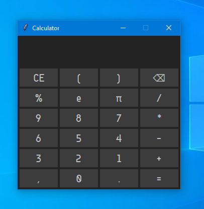
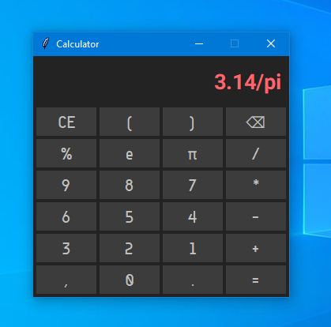

<div align="center">
    <a href="https://github.com/SparrowSurya/calc">
        <h1>Calculator</h1>
    </a>
    <i>made in python</i>
</div>

<br />
<div align="center">
    
    
</div>
<br />


This project aims to make a simple calculator app.
It also aims to make it better with simplicity.
The project discourage use of any external dependency (mostly).
External tools for maintenance are acceptable.


## Features
* Number: int or float or their scientific form
* binary operators: `+ (plus)`, `- (minus)`, `* (multiply)`, `/ (divide)`, `% (modulus)`, `** (power)`
* unary operators: `+ (positive)`, `- (negative)`
* operator precedence (supports `BODMAS`)
* brackets allowed `(` and `)`
* supports [functions](./calc/evaluator/functions.py) and [constants](./calc/evaluator/constants.py).
* functions can have fixed, optional or atleast one args
* decent GUI & CLI application.


## Run the program
Running GUI application:
```sh
python -m calc.app
```

Running as CLI application (see help):
```sh
python -m calc -h
```

Running the program:
```sh
python main.py
```


## Contributing
* only be watching for errors or bugs issues.
* No PR's


## Demo

<div>
    
    <br />
    
</div>


## Grammar
```
EXPR := TERM
    | (PLUS | MINUS) EXPR

EXPRS := EXPR
    | COMMA EXPRS

TERM := FACTOR
    | (MUL | DIV | MOD | POW) TERM

FACTOR := NUM
    | LAPREN EXPR RPAREN
    | (PLUS | MINUS) FACTOR
    | NAME LPAREN EXPRS RPAREN
    | NAME

PLUS := '+'
MINUS := '-'
MUL := '*'
DIV := '/'
MOD := '%'
POW := '^'
LPREN := '('
RPAREN := ')'
COMMA := ','
NUM := '[0-9]+(\.[0-9]+)?([+-]?[eE][0-9]+)?'
```

